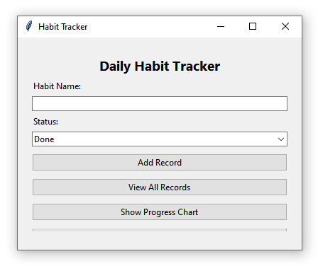
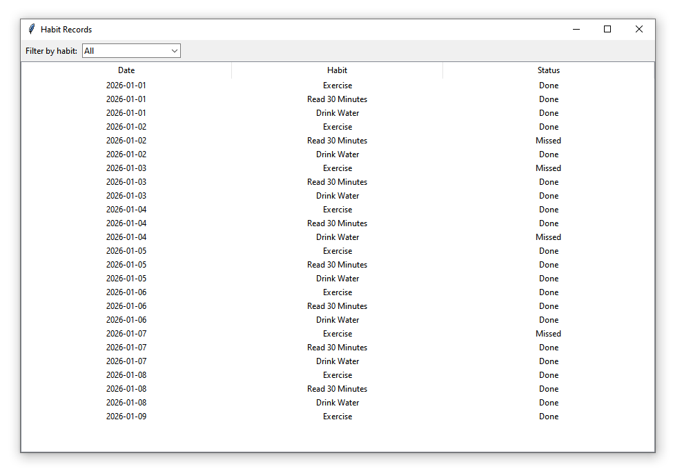
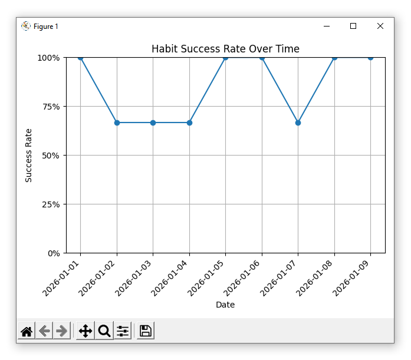

# 📅 Habit Tracker (Python + Tkinter)


## About the Project

Habit Tracker is a desktop application built with **Python**, **Tkinter**, **Pandas**, and **Matplotlib** for tracking daily habits and monitoring personal progress. Users can record completed or missed habits, browse previous records, calculate streaks, and visualize progress using charts and a calendar-style heatmap. All data is stored locally in a CSV file, so the application works completely offline.

---

## Screenshots

### Main Window



### Habit Records



### Progress Heatmap



---

## Features

* Record daily habits as **Done** or **Missed**.
* View all saved habit records.
* Filter records by habit name.
* Display daily success-rate charts.
* Calculate current and longest streaks.
* Visualize progress with a GitHub-style heatmap.
* Store all data locally in CSV format.

---

## Technologies Used

* Python 3.7
* Tkinter
* Pandas
* Matplotlib
* Seaborn

---

## Requirements

* Python **3.7**

Install the required packages:

```bash
pip install -r requirements.txt
```

---

## Project Structure

```text
habit-tracker-python/
├── habit_tracker.py
├── data/
│   └── habits.csv
├── screenshots/
│   ├── main-window.png
│   ├── habit-records.png
│   └── heatmap.png
├── requirements.txt
├── .gitignore
└── README.md
```

---

## Installation

1. Clone this repository.
2. Install the dependencies.
3. Run:

```bash
python habit_tracker.py
```

---

## Future Improvements

* Weekly and monthly statistics.
* Custom habit categories.
* Goal completion percentages.
* Export charts as PNG.
* Dark mode interface.
